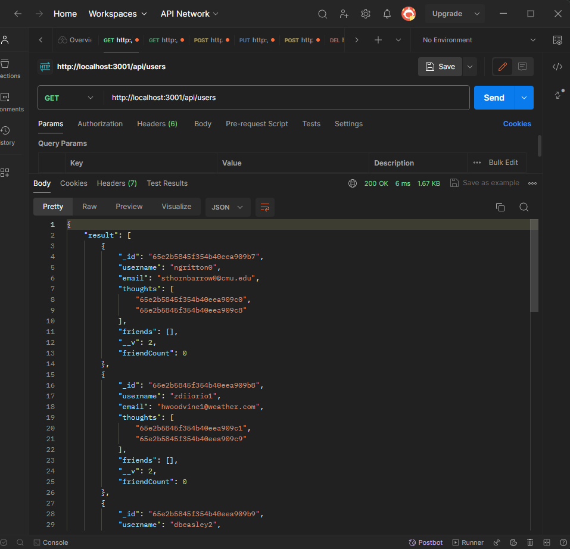
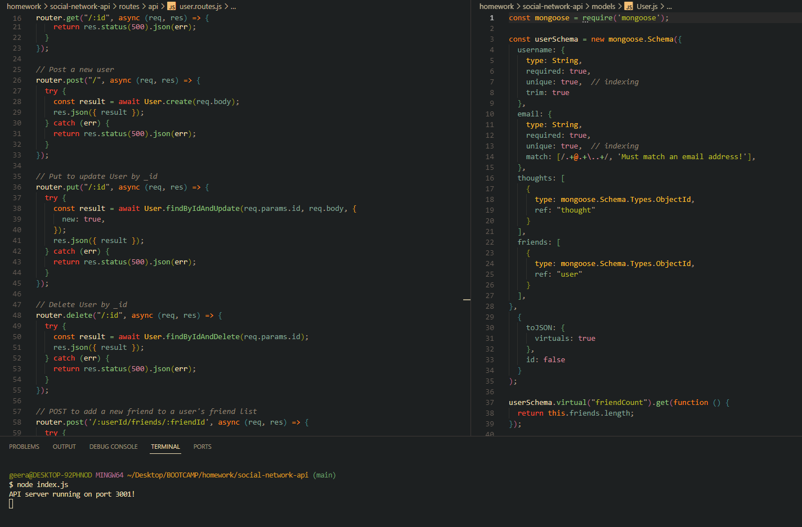

# Social Media Api (MongoDB, Express, Mongoose, Nodejs)

## Description

This project mimics the backend of a social media app, in which users can post thoughts, add each other as friends, and react to others' thoughts.

The project utilizes Nodjs, Express, MongoDB and Mongoose as the tech stack.

## Table of Contents (Optional)

- [Installation](#installation)
- [Usage](#usage)
- [Video and Screenshots](#video-and-screenshots)
- [How to contribute](#how-to-contribute)
- [Tests](#tests)
- [Questions](#questions)
- [License](#license)

## Installation

1. Clone the repository.
2. Run `npm install` in the terminal in the root directory.
3. Seed the database: run `node utils/seed.js` in the terminal in the root directory.
4. Now you should be ready to access the api routes through Postman, Insomnia or other such apps.

## Usage

Make API calls via an API platform.

## Video and Screenshots

### [Video Walkthrough](https://drive.google.com/file/d/1sIGmOUhg97lBBFM2iQOtdKiyuLKtQZw8/view)

## How to Contribute

Contributions are not accepted.

## Tests

No tests are available at this time.

## Questions

Github: [ag-bootcamp-umn](https://github.com/ag-bootcamp-umn)

## Credits

Much appreciation to my instructor and teaching assistants, Gary Almes, Katy Vincent, Jessica Guico, and my tutor, Megan Meyers.

## License

Licensed under the [MIT](https://opensource.org/license/mit/) license.
